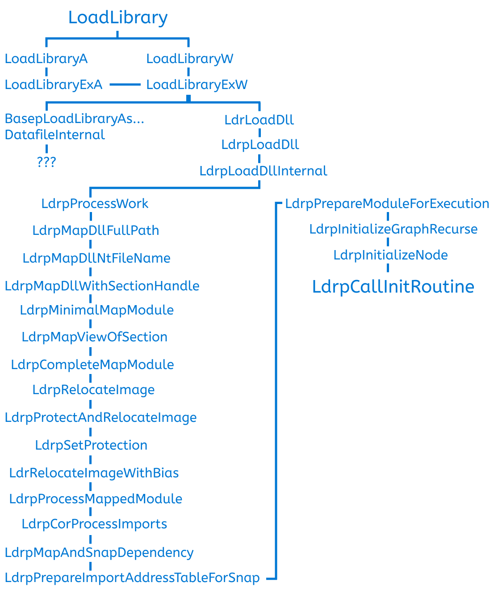

 

# LEGAL NOTICE
<ins><b>I do not take responsibility for any misuse of these information in any way.</b></ins>

The purpose of these series are **only** to understand Windows better, there is a lot to discover.

# Information
There will be some terms I use you may not understand, so I wanted to explain them in here first.

### Levels
The depth level (it's what I say) of the functions, as the level get higher, the functions get less documented and harder to understand.
   
 [Discord](https://discord.gg/9qe38utdBJ "For other questions etc.")

# What is LoadLibrary?
LoadLibrary is a Windows API function used for loading modules into programs.

The usage is pretty simple, you include Windows.h into your project, then you can use it.

There is 4 main LoadLibrary functions you can use
- [LoadLibraryA](https://learn.microsoft.com/en-us/windows/win32/api/libloaderapi/nf-libloaderapi-loadlibrarya "MSDN Reference")
- [LoadLibraryW](https://learn.microsoft.com/en-us/windows/win32/api/libloaderapi/nf-libloaderapi-loadlibraryw "MSDN Reference")
- [LoadLibraryExA](https://learn.microsoft.com/en-us/windows/win32/api/libloaderapi/nf-libloaderapi-loadlibraryexa "MSDN Reference")
- [LoadLibraryExW](https://learn.microsoft.com/en-us/windows/win32/api/libloaderapi/nf-libloaderapi-loadlibraryexw "MSDN Reference")

Even if they look like seperate, they all end up in **LoadLibraryExW** finally, wanna learn how? Keep reading.

Here is a basic diagram to show what functions are called in order to load a module into a process (maybe not exact represantation). 
( ! ) The path was given **absolute** and **no flags** were given. 

Now that it may look confusing, but I will try to explain each function one by one.
